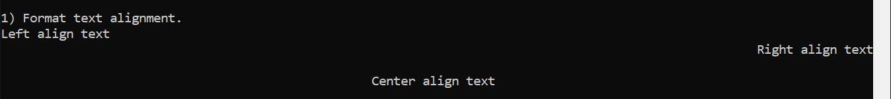
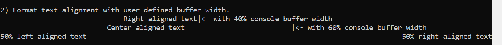
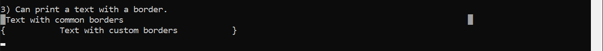
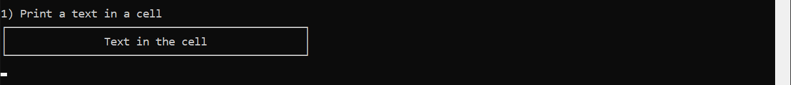

# Console Text Format lib (libcontf)
#### v1.1

##### _Description_
Console-Text-Format-lib is a C library that can handle different text formats and alignments. It also has the ability to create text-based graphics. Developers have to go through a difficult path to deal with the strings of the C language. It will be more difficult in console programs. Therefore, this library helps to reduce the size of the code for printing.

>When you want to print text in the center of the console window, you will do the following; But do you believe you can find the right center using the tab spaces?
```C
printf("\t\t\tLet's hope this is a ceter-aligned text.");
```

##### _Available Features of the current version_
1. Text alignment of the output _(left, center, right)_  
   
2. Change the buffer width of the formatted text
   
3. Draw borders _(left & right)_ of the formatted text.  
   It will help to create text arts, tables, shapes, etc.  
   
4. Draw horizontal lines with user-defined settings _(line format, size, ends)_  
     
   
5. Ability to combine text format functions with line drawing functions.
   

##### _How to use libcontf_
1. Add the static library and the header to your c project
   It is better if you make a folder (ex:include) for headers in your workspace folder. 
2. Add the include path to project in your IDE or text editor.
   >_**VsCode:** c_cpp_properties.json_  
   ```json
   "includePath": [
        "${default}",
        "${workspaceFolder}/include"
    ],
    ```
3. include the header _**(contf.h)**_ to your code.
4. Compile the code with including the header and the library  
   `gcc -g {C file} -I {include folder} -L {library folder} -lcontf -o {output file}`
   >_**VsCode:** tasks.json_  
   ```json
   "args": [
        "-g",
        "${file}",
        "-I",
        "${workspaceFolder}\\include",
        "-L",
        "${workspaceFolder}",
        "-lcontf",
        "-o",
        "${fileDirname}\\${fileBasenameNoExtension}.exe"
    ],
    ```
5. Make sure to **don't run the program in intergrated terminals.**  
   libcontf won't initialize in intergrated terminals.  
   >_**VsCode:** launch.json_  
   ```json
   "externalConsole": true,
    ```

_Copyright (c) 2021 Naveen Dharmathunga_